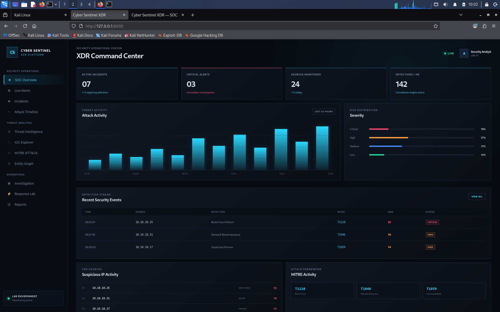
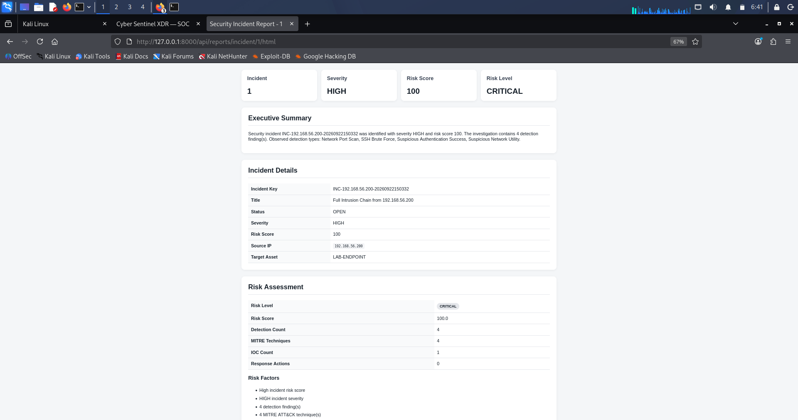
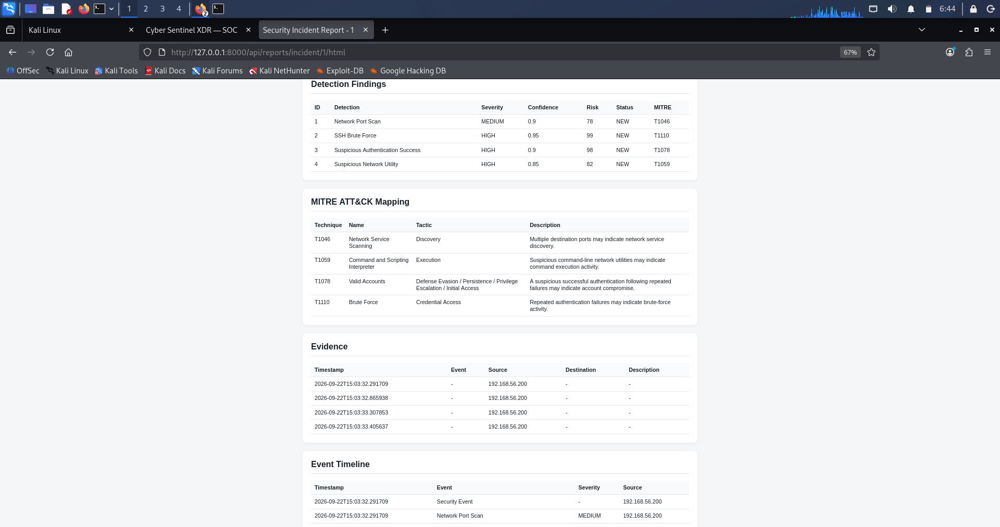

# Cyber Sentinel XDR

[](https://www.python.org/)
[](https://fastapi.tiangolo.com/)
[](https://www.docker.com/)
[](#testing)
[](#security-design)

A defensive, lab-focused Extended Detection and Response (XDR) platform for security monitoring, threat detection, threat intelligence, investigation, attack simulation, and incident reporting.

## Overview

Cyber Sentinel XDR is a Python/FastAPI-based cybersecurity platform designed as a controlled security operations lab.

It combines:

- Security telemetry ingestion
- Detection rules and runtime thresholds
- Event correlation and deduplication
- Risk scoring
- MITRE ATT&CK mapping
- Threat intelligence and IOC analysis
- Entity and attack graphs
- SOC dashboard
- Investigation workspace
- LAB-only response and containment
- Controlled attack simulation
- Automated incident reports
- Automated testing
- Docker deployment

> **Safety:** This project is designed for defensive security research and controlled laboratory environments. Attack simulation functionality is intentionally LAB-only and does not perform real-world attacks or containment.

---

## Architecture

```text
                    ┌──────────────────────┐
                    │   Security Telemetry │
                    └──────────┬───────────┘
                               │
                               ▼
                    ┌──────────────────────┐
                    │   Event Processing   │
                    └──────────┬───────────┘
                               │
                               ▼
                    ┌──────────────────────┐
                    │   Detection Engine   │
                    └──────────┬───────────┘
                               │
                    ┌──────────┴──────────┐
                    ▼                     ▼
             ┌─────────────┐       ┌─────────────┐
             │ Correlation │       │ Risk Engine │
             └──────┬──────┘       └──────┬──────┘
                    │                     │
                    └──────────┬──────────┘
                               ▼
                    ┌──────────────────────┐
                    │ Incident Management  │
                    └──────────┬───────────┘
                               │
             ┌─────────────────┼─────────────────┐
             ▼                 ▼                 ▼
      ┌─────────────┐   ┌─────────────┐   ┌─────────────┐
      │ Threat Intel│   │ MITRE ATT&CK│   │ Attack Graph│
      └─────────────┘   └─────────────┘   └─────────────┘
                               │
                               ▼
                    ┌──────────────────────┐
                    │     SOC Dashboard    │
                    └──────────┬───────────┘
                               │
             ┌─────────────────┼─────────────────┐
             ▼                 ▼                 ▼
      ┌─────────────┐   ┌─────────────┐   ┌─────────────┐
      │Investigation│   │Response LAB │   │   Reports   │
      └─────────────┘   └─────────────┘   └─────────────┘

## SOC Dashboard

The SOC Command Center provides a centralized view of security activity, including incidents, alerts, threat activity, detection streams, risk distribution, suspicious sources, and MITRE ATT&CK activity.




## Screenshots

### SOC Dashboard


### Incident Report — Overview


### Incident Report — Detection & MITRE ATT&CK

